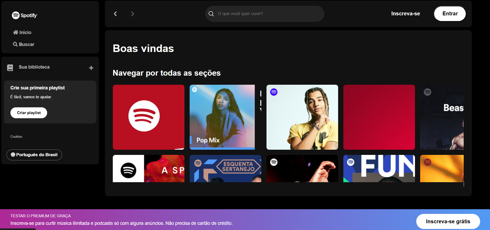

# Spotify


<p>Tela de preview do App</p>



Este repositório contém uma página simulacro do spotify App a partir de 5 dias de código e aprendizado junto à Imersão Dev Front-End da Alura.

## Funcionalidades / Functionalities

- Eu aprendi aqui a construção semântica de um Nav, Header e Footer e como você pode posicioná-los na tela;
- Limpeza dos campos de entrada e do valor convertido.
- Interface responsiva que se adapta a diferentes tamanhos de tela.

## Instalação
Para instalar as dependências necessárias, execute o seguinte comando:

```
npm install
```
    
## Uso
Para iniciar o projeto, use o seguinte comando:

```
npm start
```

## Tecnologias Utilizadas / Tools

- HTML
- CSS
- JavaScript

## Estrutura do Projeto

### index.html

O arquivo `index.html` contém a estrutura básica da página, incluindo os elementos de entrada, botões e áreas de exibição dos resultados.

Contém um Menu de navegação lateral com duas SECTIONs. Nele o usuário pode visualizar um botão inical e outro de buscar. O usuário pode também criar sua playlist ou acessar sua biblioteca num Section separada. Por fim, adicionei ao fim do container, um botão para alterar a linguagem do site.

Cabeçalho com botão input para busca de títulos e artistas com um EventListener() cuja função espera o usuário digitar e toma uma pesquisa em tempo real, consome a API, retorna um JSON e percorre uma lista com o resultado e joga de volta no DOM do HTML e exibe no container principal os resultados da busca a partir do .value() fornecido pelo usuário;

No container principal, o o site exibe um container com resultados. O número de colunas dos CARDS é definido de acordo com o tamanho de tela (media-query) sob o formato display: grid cujo formato eu ainda não conhecia e pude observar.

Por fim temos um Foooter, ou rodapé, nele temos um background com degradê, nele existem 3 seções, sendo 1 botão de inscrição para o plano premium. 
  

### script.js

Evento de Manipulação: Um evento input é adicionado ao documento. Isso significa que toda vez que o usuário digitar algo em um campo de entrada, a função associada será executada.

Busca e Comparação: Dentro da função do evento, o valor do campo de entrada (searchInput) é convertido para letras minúsculas e armazenado na variável searchTerm.

Verificação do Termo de Busca: Se o searchTerm estiver vazio (ou seja, se o usuário não digitou nada), a classe hidden é adicionada ao elemento resultPlaylist, escondendo-o. Ao mesmo tempo, a classe hidden é removida do elemento resultArtist, tornando-o visível.

Este código é parte de uma funcionalidade de busca onde, dependendo do termo de busca, diferentes resultados são exibidos ou escondidos.

### style.css

O arquivo style.css contém os estilos para a página, incluindo a configuração de uma imagem de fundo, estilos para os elementos de entrada e botões, e media queries para tornar a aplicação responsiva:

* Resetei as configurações iniciais de estilização fazendo um scaffold pelo Copilot e liguei no HTML;
* Usei um background color com degradê no footer e aprendi nesse projeto a colocar  no container para contrastar com a imagem de fundo "background: linear-gradient";
* Atribuí variávies para as fontes e cores padrão do projeto utilizadas e coloquei num arquivo var.css;
* Estilizei os botões e acrescentei margens e paddings, aprendi a estilizar as bordas;
* Pedi ao Co-Pilot para fazer os media-queries do projeto e implementei depois de testes usando a inspeção do navegador para diferentes displays.
* apliquei displays diversos como flex e o grid e defini o número de colunas para a exibição dos resultados da busca conforme o tamanho da tela.

## Como contribuir / How Contribute

```bash
# Clone the project
$ git clone https://github.com/bhclira/spotify-imersao/
```
